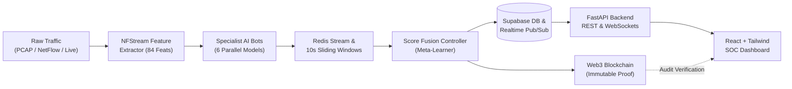

# 📚 Documentation Suite

Welcome to the technical documentation suite for the **AI-Powered Cyber Threat Detection System**. This repository houses the architectural designs, machine learning specifications, feature extraction dictionaries, database schemas, smart contract specifications, and operational manuals for the platform.

---

## 🗺️ Documentation Directory

| Manual | Description | Key Topics |
| :--- | :--- | :--- |
| [**Architecture Specification**](architecture.md) | End-to-end system architecture & runtime data flow | Ingestion $\rightarrow$ NFStream Extractor $\rightarrow$ 6 AI Bots $\rightarrow$ Redis Streaming $\rightarrow$ Score Fusion Controller $\rightarrow$ Supabase $\rightarrow$ Blockchain $\rightarrow$ React UI |
| [**AI Bot Specifications**](bot_specs.md) | Deep dive into all 6 Specialist Detection Bots | DDoS, Beaconing, DGA DNS, Encrypted Malware, Scanning, Exfiltration model architectures, hyperparameters, loss functions, thresholds |
| [**Feature Engineering**](feature_engineering.md) | 84-feature extraction dictionary & mathematical formulations | NFStream/CICFlowMeter statistical metrics, DNS lexical & Shannon entropy, TLS JA3/JA4 cryptographic signatures |
| [**Alert & Database Schema**](alert_schema.md) | Supabase PostgreSQL DDL & JSON event schemas | `network_flows`, `threat_alerts`, `bot_metrics`, `blockchain_logs`, `dga_domains`, `dns_queries` table schemas, severity rubric |
| [**Blockchain Audit Trail**](blockchain_design.md) | Immutable on-chain verification design | `AlertLog.sol` Solidity contract, Keccak-256 alert payload hashing, Web3.py integration, EVM testnet deployment |
| [**Live Demo Script**](demo_script.md) | Step-by-step demonstration walkthrough for evaluators | 6-Phase *Operation ShadowInfiltrate* campaign simulation, live SOC triage, on-chain proof validation |
| [**Team Development Workflow**](team_workflow.md) | Engineering guidelines & collaboration standards | Git branching model, code review criteria, dataset verification, pytest automation, CI/CD pipeline |

---

## 🚀 Quick Architecture Summary

---

## 📖 Recommended Reading Path

1. **For System Architects & Engineers**: Start with [Architecture](architecture.md), followed by [Alert Schema](alert_schema.md) and [Team Workflow](team_workflow.md).
2. **For Data Scientists & ML Engineers**: Read [Feature Engineering](feature_engineering.md) and [AI Bot Specifications](bot_specs.md).
3. **For Security Analysts & Demonstrators**: Read [Live Demo Script](demo_script.md) and [Alert Schema](alert_schema.md).
4. **For Blockchain Developers**: Review [Blockchain Design](blockchain_design.md).
