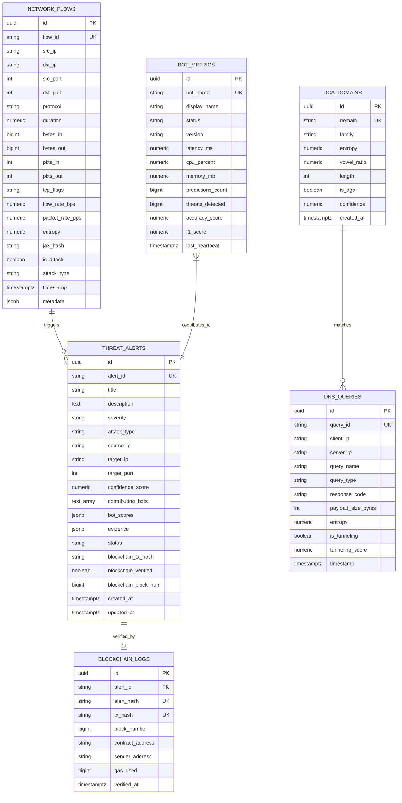

# 📋 Alert Schema, Database Specifications & Evidence Normalization

This manual specifies the relational database schema, REST API serialization formats, WebSocket event payloads, severity classification rubrics, and forensic evidence structures used throughout the **AI-Powered Cyber Threat Detection System**.

---

## 🗄️ Database Architecture (Supabase PostgreSQL)

The database schema is defined in [`data/supabase_schema.sql`](file:///mnt/datasheets/SIH_2026%20%28Copy%29/data/supabase_schema.sql) and implemented via SQLAlchemy models in `backend/app/db/models.py`.



---

## 1. Threat Alert Table & JSON Payload (`threat_alerts`)

### 1.1 Complete PostgreSQL DDL
```sql
CREATE TABLE public.threat_alerts (
    id UUID PRIMARY KEY DEFAULT gen_random_uuid(),
    alert_id VARCHAR(64) UNIQUE NOT NULL,
    title VARCHAR(255) NOT NULL,
    description TEXT NOT NULL,
    severity VARCHAR(20) NOT NULL CHECK (severity IN ('LOW', 'MEDIUM', 'HIGH', 'CRITICAL')),
    attack_type VARCHAR(64) NOT NULL,
    source_ip VARCHAR(45) NOT NULL,
    target_ip VARCHAR(45) NOT NULL,
    target_port INTEGER,
    confidence_score NUMERIC(5, 4) NOT NULL CHECK (confidence_score >= 0.0 AND confidence_score <= 1.0),
    contributing_bots TEXT[] NOT NULL DEFAULT '{}',
    bot_scores JSONB NOT NULL DEFAULT '{}',
    evidence JSONB NOT NULL DEFAULT '{}',
    status VARCHAR(30) NOT NULL DEFAULT 'NEW' CHECK (status IN ('NEW', 'INVESTIGATING', 'RESOLVED', 'FALSE_POSITIVE')),
    blockchain_tx_hash VARCHAR(66) DEFAULT NULL,
    blockchain_verified BOOLEAN NOT NULL DEFAULT FALSE,
    blockchain_block_num BIGINT DEFAULT NULL,
    created_at TIMESTAMPTZ NOT NULL DEFAULT NOW(),
    updated_at TIMESTAMPTZ NOT NULL DEFAULT NOW()
);

-- Optimized query indexes
CREATE INDEX idx_threat_alerts_severity ON public.threat_alerts(severity);
CREATE INDEX idx_threat_alerts_attack_type ON public.threat_alerts(attack_type);
CREATE INDEX idx_threat_alerts_created_at ON public.threat_alerts(created_at DESC);
CREATE INDEX idx_threat_alerts_source_ip ON public.threat_alerts(source_ip);
CREATE INDEX idx_threat_alerts_status ON public.threat_alerts(status);
```

### 1.2 REST API & WebSocket Alert JSON Format
```json
{
  "alert_id": "ALT-20260827-09412",
  "title": "High-Volume TCP SYN Flood Targeting Gateway",
  "description": "Massive ingress burst of 46,356 packets/sec detected from narrow spoofed IP pool with zero ACK responses.",
  "severity": "CRITICAL",
  "attack_type": "DDOS_SYN_FLOOD",
  "source_ip": "45.33.12.227",
  "target_ip": "10.0.10.20",
  "target_port": 80,
  "confidence_score": 0.9850,
  "contributing_bots": [
    "ddos_bot",
    "scanning_bot"
  ],
  "bot_scores": {
    "ddos_bot": 0.9920,
    "scanning_bot": 0.7410,
    "beaconing_bot": 0.0120,
    "dga_dns_bot": 0.0000,
    "encrypted_malware_bot": 0.0000,
    "exfiltration_bot": 0.0050
  },
  "evidence": {
    "packet_rate_pps": 46356.0,
    "flow_rate_bps": 16386000.0,
    "source_entropy": 0.0912,
    "tcp_flags": "SYN",
    "syn_ack_ratio": 0.0000,
    "raw_pcap_offset": "0x0001fa20"
  },
  "status": "NEW",
  "blockchain_tx_hash": "0x8f3c71a9b4d5e6f7a8b9c0d1e2f3a4b5c6d7e8f9a0b1c2d3e4f5a6b7c8d9e0f1",
  "blockchain_verified": true,
  "blockchain_block_num": 18459201,
  "created_at": "2026-08-27T19:35:10.450Z"
}
```

---

## 2. Severity Escalation & Score Fusion Rubric

The Main Controller fuses individual bot predictions into a consolidated score using the **Dynamic Confidence Weight Matrix**:

$$\text{Final Score} = \sum_{i=1}^{6} w_i \cdot S_i + \text{Correlation Boost}$$

| Severity Tier | Score Range | Contributing Bot Thresholds | Immediate Action / Response |
| :--- | :--- | :--- | :--- |
| **CRITICAL** | **$0.95 - 1.00$** | Primary Bot $\ge 0.95$ OR 2+ Bots $\ge 0.85$ | Automatic on-chain commit, audio/visual SOC alarm, firewall rule generation |
| **HIGH** | **$0.85 - 0.94$** | Primary Bot $\ge 0.85$ OR 2+ Bots $\ge 0.75$ | Automatic on-chain commit, SOC priority triage queue |
| **MEDIUM** | **$0.70 - 0.84$** | Primary Bot $\ge 0.70$ | Supabase DB logging, dashboard highlight |
| **LOW** | **$0.50 - 0.69$** | Single Bot anomaly ($0.50 - 0.69$) | Telemetry log, aggregated in temporal window |
| **BENIGN** | **$< 0.50$** | All Bots $< 0.50$ | Standard flow logging in `network_flows` |

---

## 3. Bot Metrics Table (`bot_metrics`)

Maintains live telemetry for system health, resource consumption, and accuracy metrics displayed on the **Bot Health Panel** in the dashboard.

```sql
CREATE TABLE public.bot_metrics (
    id UUID PRIMARY KEY DEFAULT gen_random_uuid(),
    bot_name VARCHAR(64) UNIQUE NOT NULL,
    display_name VARCHAR(128) NOT NULL,
    status VARCHAR(20) NOT NULL DEFAULT 'HEALTHY' CHECK (status IN ('HEALTHY', 'DEGRADED', 'OFFLINE', 'INITIALIZING')),
    version VARCHAR(32) NOT NULL DEFAULT '1.0.0',
    latency_ms NUMERIC(8, 2) NOT NULL DEFAULT 0.0,
    cpu_percent NUMERIC(5, 2) NOT NULL DEFAULT 0.0,
    memory_mb NUMERIC(8, 2) NOT NULL DEFAULT 0.0,
    predictions_count BIGINT NOT NULL DEFAULT 0,
    threats_detected BIGINT NOT NULL DEFAULT 0,
    accuracy_score NUMERIC(5, 4) DEFAULT 0.9850,
    f1_score NUMERIC(5, 4) DEFAULT 0.9820,
    last_heartbeat TIMESTAMPTZ NOT NULL DEFAULT NOW()
);
```

---

## 4. Blockchain Logs Table (`blockchain_logs`)

Maintains the relationship between on-chain smart contract transactions and local alert records.

```sql
CREATE TABLE public.blockchain_logs (
    id UUID PRIMARY KEY DEFAULT gen_random_uuid(),
    alert_id VARCHAR(64) REFERENCES public.threat_alerts(alert_id) ON DELETE CASCADE NOT NULL,
    alert_hash VARCHAR(66) UNIQUE NOT NULL,
    tx_hash VARCHAR(66) UNIQUE NOT NULL,
    block_number BIGINT NOT NULL,
    contract_address VARCHAR(42) NOT NULL,
    sender_address VARCHAR(42) NOT NULL,
    gas_used BIGINT NOT NULL DEFAULT 45000,
    verified_at TIMESTAMPTZ NOT NULL DEFAULT NOW()
);
```

---

## 5. Row-Level Security (RLS) & Realtime Publication

To protect telemetry from unauthorized modification while enabling live WebSocket streaming:

```sql
-- Enable Row Level Security
ALTER TABLE public.threat_alerts ENABLE ROW LEVEL SECURITY;
ALTER TABLE public.network_flows ENABLE ROW LEVEL SECURITY;
ALTER TABLE public.bot_metrics ENABLE ROW LEVEL SECURITY;
ALTER TABLE public.blockchain_logs ENABLE ROW LEVEL SECURITY;

-- Allow read-only access to authenticated analysts & dashboard
CREATE POLICY "Allow public read-only access" ON public.threat_alerts FOR SELECT USING (true);
CREATE POLICY "Allow public read-only access" ON public.network_flows FOR SELECT USING (true);
CREATE POLICY "Allow public read-only access" ON public.bot_metrics FOR SELECT USING (true);
CREATE POLICY "Allow public read-only access" ON public.blockchain_logs FOR SELECT USING (true);

-- Enable Supabase Realtime for instant UI push notifications
ALTER PUBLICATION supabase_realtime ADD TABLE public.threat_alerts;
ALTER PUBLICATION supabase_realtime ADD TABLE public.bot_metrics;
```
