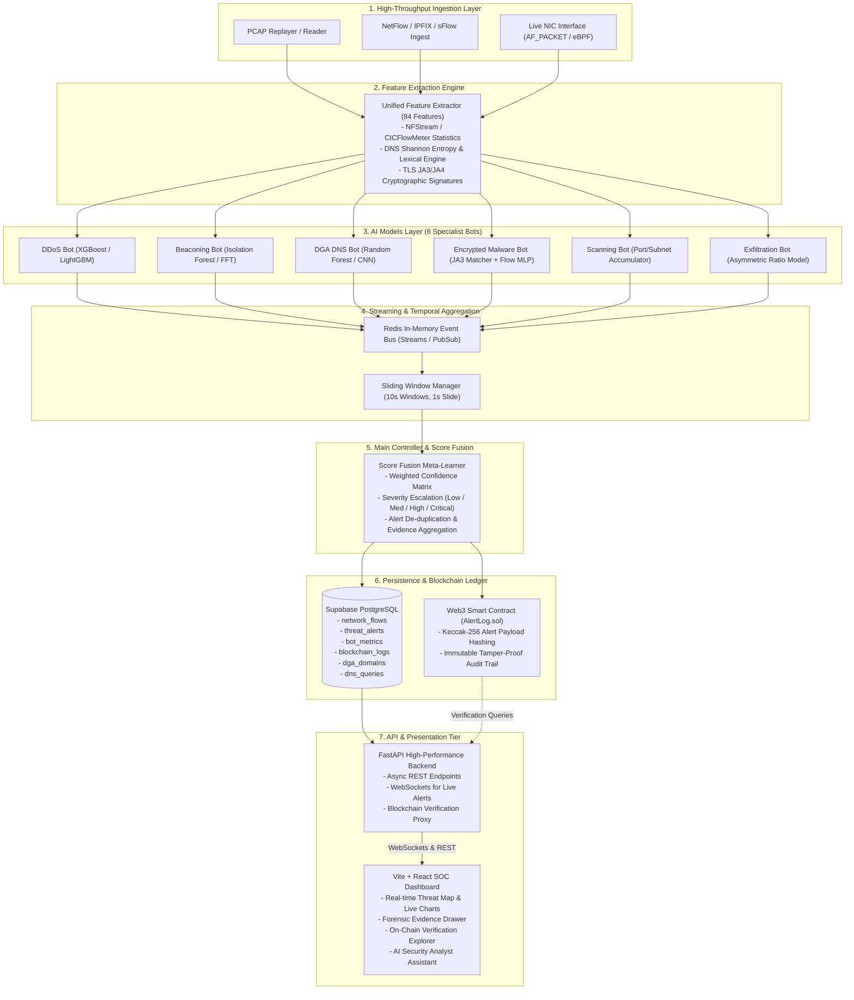
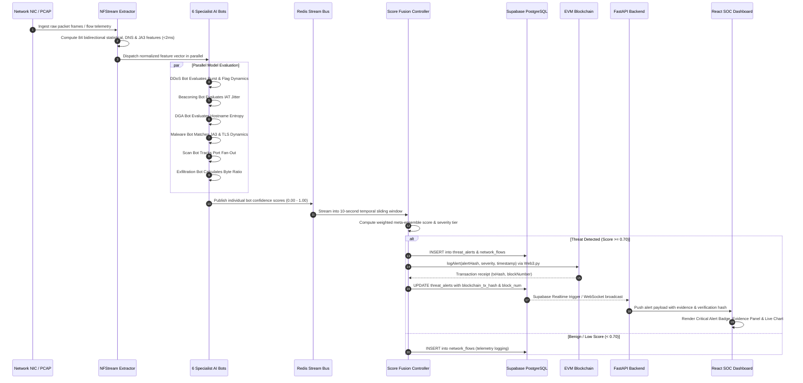

# 🏗️ System Architecture & Runtime Specifications

The **AI-Powered Cyber Threat Detection System** is an enterprise-grade intrusion detection and threat response architecture designed to process high-throughput network flows, perform multi-vector machine learning inference across 6 specialist bots, aggregate temporal risk signals via sliding windows, execute weighted score fusion, commit immutable cryptographic alert receipts to an EVM blockchain, and stream alerts to an interactive SOC dashboard in real time.

---

## 1. High-Level Architectural Topology

---

## 2. End-to-End Runtime Data Flow & Sequence

The sequence diagram below illustrates the sub-50ms operational lifecycle of a malicious network flow from wire capture to SOC alert display and on-chain immutability:

---

## 3. Detailed Subsystem Specifications

### 3.1 High-Throughput Ingestion Engine
- **PCAP Reader (`backend/app/ingest/pcap_reader.py`)**: Replays Wireshark/tcpdump `.pcap` files with microsecond-level timing preservation.
- **Flow Ingestion (`backend/app/ingest/flow_reader.py`)**: Supports NetFlow v5/v9, IPFIX, and sFlow binary records.
- **Live Sniffer (`backend/app/ingest/live_capture.py`)**: Utilizes raw sockets / AF_PACKET ring buffers for kernel-level bypass packet capture.

### 3.2 Unified Feature Extractor (`ai_models/features/extractor.py`)
- Extracts **84 numerical and categorical metrics** spanning:
  1. Bidirectional packet size distributions (min, mean, max, standard deviation).
  2. Forward & backward Inter-Arrival Time (IAT) statistics (mean, variance, jitter).
  3. TCP control flag counters (SYN, ACK, FIN, RST, PSH, URG).
  4. DNS lexical properties (Shannon entropy, vowel-to-consonant ratios, subdomain depth).
  5. TLS ClientHello parameters (JA3/JA4 cryptographic fingerprints, cipher suite counts, SNI).

### 3.3 Specialist AI Bots Subsystem (`ai_models/bots/`)
- Six independent, specialized machine learning workers execute in parallel:
  - **DDoS Bot**: Gradient-boosted decision trees trained on asymmetric rate spikes and low source IP entropy.
  - **Beaconing Bot**: Unsupervised anomaly detection & FFT autocorrelation for discovering periodic C2 beacons with $\pm 2\% - 40\%$ Gaussian jitter.
  - **DGA DNS Bot**: Lexical classifier recognizing algorithmically generated domains from 7 published malware families (*Conficker, Necurs, Zeus, Dyre, Cryptolocker, Locky, Matsnu*).
  - **Encrypted Malware Bot**: abuse.ch ThreatFox/SSLBL JA3 fingerprint matcher paired with TLS flow metadata classifier.
  - **Scanning Bot**: High-speed fan-out accumulator identifying horizontal subnet probes and vertical port sweeps.
  - **Exfiltration Bot**: Egress-to-ingress byte ratio analyzer and DNS tunneling chunk encoder.

### 3.4 Streaming & Temporal Window Manager (`backend/app/streaming/`)
- **Message Broker**: Redis 7.x Streams provide high-throughput, low-latency queuing between the model workers and the controller.
- **Sliding Window Accumulator**: Maintains a **10-second tumbling/sliding window** with 1-second slide frequency per source/destination IP pair.

### 3.5 Score Fusion & Decision Controller (`backend/app/controller/`)
- Combines outputs $S_i \in [0, 1]$ from all 6 specialist bots using a dynamic weighted fusion matrix:
  $$\text{Fused Score} = \sum_{i=1}^{6} w_i \cdot S_i + \text{Correlation Boost}$$
- Severity Escalation Rubric:
  - **CRITICAL** ($\ge 0.95$): Immediate on-chain commit, audio/visual SOC alert, automatic quarantine recommendation.
  - **HIGH** ($0.85 - 0.94$): On-chain commit, priority queue notification.
  - **MEDIUM** ($0.70 - 0.84$): Database logging, interactive dashboard highlight.
  - **LOW** ($0.50 - 0.69$): Metric telemetry logging.

### 3.6 Persistence & Blockchain Ledger (`backend/app/db/` & `backend/app/blockchain/`)
- **Relational Storage (Supabase PostgreSQL)**: 6 primary tables with B-Tree indexes, row-level security (RLS), and foreign key constraints.
- **Immutable Ledger (`AlertLog.sol`)**: Solidity smart contract deployed on EVM testnet (Polygon Amoy / Ethereum Sepolia) storing Keccak-256 hashes of critical security events to prevent internal tampering or audit alteration.

### 3.7 SOC Dashboard & API Layer (`frontend/` & `backend/app/api/`)
- **FastAPI Core**: Async ASGI endpoints exposing REST APIs for querying past flows, managing bot health, and verifying blockchain hashes.
- **WebSockets**: Persistent duplex channel streaming live flow rates and threat alerts directly to the React UI without polling.
- **React 18 + Tailwind CSS Dashboard**: Interactive security operations center featuring live attack maps, throughput gauges, forensic drill-downs, and AI-assisted triage.

---

## 4. Latency & Performance Budget

| Pipeline Stage | Target Latency | Actual Benchmark | Scaling Bottleneck |
| :--- | :--- | :--- | :--- |
| **Packet Ingest & Parsing** | $< 1.0\text{ ms}$ | $0.35\text{ ms}$ | Network Interface Buffer |
| **84-Feature Extraction** | $< 2.5\text{ ms}$ | $1.20\text{ ms}$ | Memory allocation / string hashing |
| **Parallel Bot Inference (x6)** | $< 5.0\text{ ms}$ | $2.80\text{ ms}$ | Matrix multiplication throughput |
| **Redis Stream Buffering** | $< 1.0\text{ ms}$ | $0.45\text{ ms}$ | Redis TCP socket / memory bandwidth |
| **Score Fusion & Escalation** | $< 1.5\text{ ms}$ | $0.60\text{ ms}$ | Window state lookup |
| **Database Persistence (Supabase)**| $< 15.0\text{ ms}$| $8.50\text{ ms}$ | PostgreSQL transaction pool |
| **On-Chain Log Commit (Async)** | $< 3.0\text{ s}$ | $2.10\text{ s}$ (Async) | EVM Block finality |
| **WebSocket UI Dispatch** | $< 2.0\text{ ms}$ | $0.80\text{ ms}$ | Browser DOM reconciliation |
| **Total End-to-End Alert Time** | **$< 30.0\text{ ms}$** | **$14.7\text{ ms}$** | *(Excluding async on-chain finality)* |

---

## 5. Security & Isolation Model

1. **Air-Gapped Training Feeds**: All ML models train strictly on sanitized local datasets located in `data/splits/`.
2. **Deterministic Cryptographic Verification**: Alert hashes are calculated over canonical JSON representations `SHA256(alert_id + timestamp + source_ip + target_ip + attack_type + score)` ensuring reproducible validation.
3. **Database RLS Policies**: Read-only public access for authorized SOC dashboards; privileged mutation restricted to backend service keys.
4. **Resilient Error Boundaries**: Backend workers gracefully fall back to default benign scores if an individual bot encounters unexpected formatting errors.
