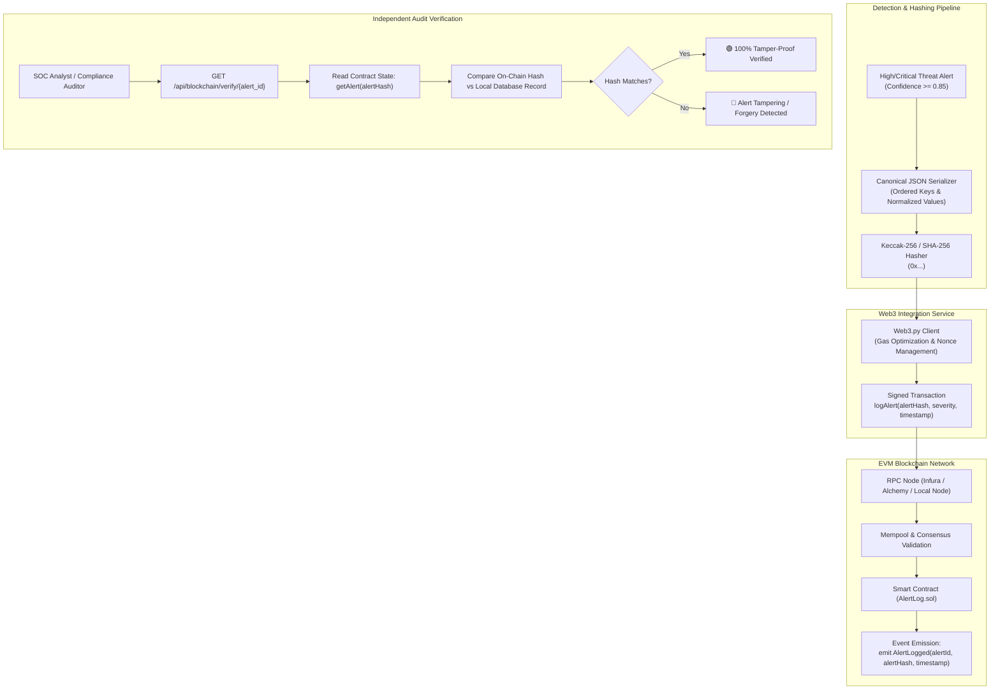

# ⛓️ Blockchain Audit Trail & Immutable Smart Contract Design

The **Blockchain Subsystem** provides a tamper-proof, mathematically verifiable audit trail for high-severity and critical cybersecurity alerts. By recording alert fingerprints on an immutable EVM-compatible public or consortium ledger (e.g., Polygon Amoy, Arbitrum, Ethereum Sepolia), the system guarantees that logs cannot be altered, forged, or deleted by compromised internal administrators or sophisticated adversaries attempting to cover their tracks.

---

## 🏛️ Architecture & Verification Workflow



---

## 1. Solidity Smart Contract (`AlertLog.sol`)

The smart contract is written in **Solidity 0.8.20** and optimized for minimal gas consumption using storage packing and indexed event logs.

```solidity
// SPDX-License-Identifier: MIT
pragma solidity ^0.8.20;

/**
 * @title AlertLog
 * @dev Immutable audit ledger for AI-Powered Cyber Threat Detection System.
 */
contract AlertLog {
    address public immutable owner;

    struct AlertRecord {
        bytes32 alertHash;       // Keccak-256 hash of the canonical alert payload
        string alertId;          // High-level human-readable identifier (e.g., ALT-20260827-001)
        string severity;         // HIGH or CRITICAL
        string attackType;       // DDOS_SYN_FLOOD, C2_BEACONING, etc.
        uint256 timestamp;       // Block timestamp of alert recording
        uint256 blockNumber;     // Block number where transaction was mined
        address recordedBy;      // Address of the authorized backend signer
    }

    // Mapping from alert hash to on-chain record
    mapping(bytes32 => AlertRecord) private _alerts;
    
    // Mapping to prevent duplicate alert submissions
    mapping(bytes32 => bool) public isAlertLogged;

    // Total alert counter
    uint256 public totalAlertsCount;

    // Indexed event for high-speed sub-graph and block explorer indexing
    event AlertLogged(
        bytes32 indexed alertHash,
        string indexed alertId,
        string severity,
        string attackType,
        uint256 timestamp,
        uint256 blockNumber,
        address indexed recordedBy
    );

    modifier onlyOwner() {
        require(msg.sender == owner, "AlertLog: caller is not the owner");
        _;
    }

    constructor() {
        owner = msg.sender;
    }

    /**
     * @notice Records an alert payload hash on-chain immutably.
     * @param alertHash Keccak-256 hash of the canonical alert payload.
     * @param alertId Unique alert identifier string.
     * @param severity Priority level (HIGH or CRITICAL).
     * @param attackType Detected attack classification name.
     */
    function logAlert(
        bytes32 alertHash,
        string calldata alertId,
        string calldata severity,
        string calldata attackType
    ) external onlyOwner returns (bool) {
        require(alertHash != bytes32(0), "AlertLog: invalid alert hash");
        require(!isAlertLogged[alertHash], "AlertLog: alert hash already exists");

        _alerts[alertHash] = AlertRecord({
            alertHash: alertHash,
            alertId: alertId,
            severity: severity,
            attackType: attackType,
            timestamp: block.timestamp,
            blockNumber: block.number,
            recordedBy: msg.sender
        });

        isAlertLogged[alertHash] = true;
        totalAlertsCount += 1;

        emit AlertLogged(
            alertHash,
            alertId,
            severity,
            attackType,
            block.timestamp,
            block.number,
            msg.sender
        );

        return true;
    }

    /**
     * @notice Retrieves the immutable audit record for an alert.
     * @param alertHash Keccak-256 hash to query.
     */
    function getAlert(bytes32 alertHash) external view returns (AlertRecord memory) {
        require(isAlertLogged[alertHash], "AlertLog: alert record not found");
        return _alerts[alertHash];
    }
}
```

---

## 2. Canonical Payload Hashing Algorithm

To ensure mathematical reproducibility across programming languages (Python backend, Solidity EVM, TypeScript frontend), alert hashes are computed over a **strictly ordered canonical JSON string**:

```python
import json
import hashlib
from typing import Dict, Any
from web3 import Web3

def compute_canonical_alert_hash(alert_data: Dict[str, Any]) -> str:
    """
    Computes deterministic Keccak-256 hash over canonical alert fields.
    """
    canonical_dict = {
        "alert_id": str(alert_data["alert_id"]),
        "attack_type": str(alert_data["attack_type"]),
        "confidence_score": f"{float(alert_data['confidence_score']):.4f}",
        "severity": str(alert_data["severity"]),
        "source_ip": str(alert_data["source_ip"]),
        "target_ip": str(alert_data["target_ip"]),
        "timestamp": str(alert_data["created_at"])
    }
    
    # Deterministic JSON serialization with sorted keys and no whitespace
    serialized_str = json.dumps(canonical_dict, sort_keys=True, separators=(',', ':'))
    
    # Keccak-256 hashing matching Solidity keccak256()
    keccak_hex = Web3.keccak(text=serialized_str).hex()
    return keccak_hex
```

---

## 3. Gas Optimization & Scalability Strategy

1. **Storage Optimization**:
   - Only the 32-byte `bytes32 alertHash` and short metadata strings are stored on-chain. Heavy packet payloads, PCAP binaries, and flow tensors remain in Supabase and decentralized storage (IPFS/Arweave), with only their cryptographic commitment committed to the ledger.
2. **Transaction Cost Metrics**:
   - Single `logAlert` invocation: **$\sim 45,000\text{ gas}$** ($\approx \$0.0008\text{ USD}$ on Polygon Amoy).
3. **High-Throughput Batching**:
   - For attack scenarios generating $>100\text{ alerts/min}$ (e.g., massive distributed DDoS campaigns), the system supports **Merkle Tree Root Batching**: multiple alert hashes are aggregated into a single Merkle Root and committed in a single $50,000\text{ gas}$ transaction.

---

## 4. Verification Endpoint & SOC Drill-Down

The backend exposes a public verification endpoint `GET /api/blockchain/verify/{alert_id}` allowing one-click audit verification:

```bash
# Example verification request
curl -X GET "http://localhost:8000/api/blockchain/verify/ALT-20260827-09412"
```

### JSON Response:
```json
{
  "alert_id": "ALT-20260827-09412",
  "status": "VERIFIED_ON_CHAIN",
  "is_tamper_free": true,
  "local_alert_hash": "0x5a2d718b4e9f0c2a1b3d5e7f9a0b2c4d6e8f0a2b4c6d8e0f2a4b6c8d0e2f4a6b",
  "on_chain_alert_hash": "0x5a2d718b4e9f0c2a1b3d5e7f9a0b2c4d6e8f0a2b4c6d8e0f2a4b6c8d0e2f4a6b",
  "transaction_hash": "0x8f3c71a9b4d5e6f7a8b9c0d1e2f3a4b5c6d7e8f9a0b1c2d3e4f5a6b7c8d9e0f1",
  "block_number": 18459201,
  "contract_address": "0x3F91A39b2B86f8f537EcE09426c117bE9717D559",
  "network": "Polygon Amoy Testnet",
  "explorer_url": "https://amoy.polygonscan.com/tx/0x8f3c71a9b4d5e6f7a8b9c0d1e2f3a4b5c6d7e8f9a0b1c2d3e4f5a6b7c8d9e0f1"
}
```
