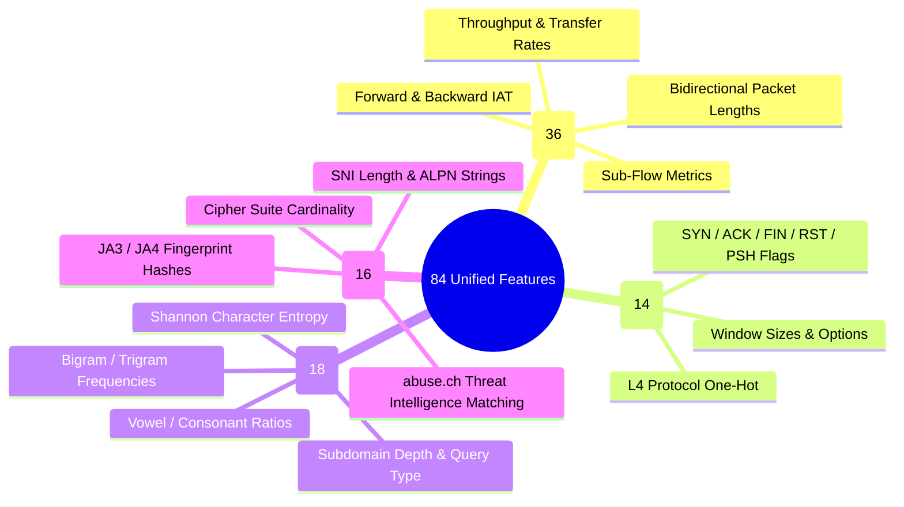
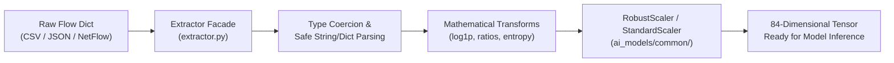

# 🔬 Feature Engineering & 84-Feature Extraction Pipeline

The feature extraction subsystem transforms raw network packet captures, NetFlow/IPFIX streams, and socket buffers into a unified **84-dimensional numerical and cryptographic feature vector** adhering to the **NFStream** (https://www.nfstream.org/) and **CICFlowMeter** industry standards.

---

## 🧭 Feature Space Organization

---

## 1. NFStream / CICFlowMeter Statistical Features (36 Metrics)

These features capture the statistical distributions of packet lengths and inter-arrival times across forward (source $\rightarrow$ destination), backward (destination $\rightarrow$ source), and bidirectional streams.

| Feature Name | Type | Unit | Description | Threat Detection Relevance |
| :--- | :--- | :--- | :--- | :--- |
| `bidirectional_duration_ms` | `float` | ms | Total active duration of bidirectional flow | Identifies short burst floods ($<10\text{ms}$) vs. persistent Slowloris ($>100\text{s}$) |
| `bidirectional_packets` | `int` | count | Total count of forward + backward packets | Volumetric DDoS detection |
| `bidirectional_bytes` | `int` | bytes | Total transfer volume in bytes | Volumetric flooding & exfiltration |
| `src2dst_packets` | `int` | count | Packets transmitted from source to destination | SYN flood detection (high out, zero in) |
| `src2dst_bytes` | `int` | bytes | Total bytes transmitted forward | Egress volume monitoring |
| `dst2src_packets` | `int` | count | Packets received from destination to source | Normal TCP ACK tracking |
| `dst2src_bytes` | `int` | bytes | Total bytes received backward | UDP reflection amplification detection |
| `src2dst_min_ps` | `int` | bytes | Minimum packet size in forward direction | Identifies empty SYN packets (40–60 bytes) |
| `src2dst_mean_ps` | `float` | bytes | Mean forward packet size | Distinguishes small commands from bulk transfers |
| `src2dst_max_ps` | `int` | bytes | Maximum forward packet size | Detects MTU-capped payloads (1460–1500 bytes) |
| `src2dst_std_ps` | `float` | bytes | Standard deviation of forward packet sizes | Uniform sizes indicate automated bot flooding |
| `dst2src_min_ps` | `int` | bytes | Minimum backward packet size | Identifies small response headers |
| `dst2src_mean_ps` | `float` | bytes | Mean backward packet size | Identifies large reflected payloads (NTP/DNS) |
| `dst2src_max_ps` | `int` | bytes | Maximum backward packet size | Large response tracking |
| `dst2src_std_ps` | `float` | bytes | Standard deviation of backward packet sizes | Response variance modeling |
| `bidirectional_min_ps` | `int` | bytes | Minimum packet size across entire flow | Protocol framing baseline |
| `bidirectional_mean_ps` | `float` | bytes | Average packet size across entire flow | General traffic profiling |
| `bidirectional_max_ps` | `int` | bytes | Maximum packet size across entire flow | Bulk file transfer detection |
| `bidirectional_std_ps` | `float` | bytes | Standard deviation of entire flow packet sizes | Natural human variance vs. synthetic traffic |
| `src2dst_min_iat_ms` | `float` | ms | Minimum forward inter-arrival time | Flood burst spacing |
| `src2dst_mean_iat_ms` | `float` | ms | Mean forward inter-arrival time | Heartbeat beaconing interval |
| `src2dst_max_iat_ms` | `float` | ms | Maximum forward inter-arrival time | Idling & timeout detection |
| `src2dst_std_iat_ms` | `float` | ms | Standard deviation of forward IAT | Jitter calculation for C2 beaconing |
| `dst2src_min_iat_ms` | `float` | ms | Minimum backward inter-arrival time | Server response speed |
| `dst2src_mean_iat_ms` | `float` | ms | Mean backward inter-arrival time | Server latency profiling |
| `dst2src_max_iat_ms` | `float` | ms | Maximum backward inter-arrival time | Keep-alive timeout profiling |
| `dst2src_std_iat_ms` | `float` | ms | Standard deviation of backward IAT | Server response variance |
| `bidirectional_min_iat_ms` | `float` | ms | Minimum bidirectional packet gap | Instantaneous burst rate |
| `bidirectional_mean_iat_ms` | `float` | ms | Mean bidirectional packet gap | Overall communication cadence |
| `bidirectional_max_iat_ms` | `float` | ms | Maximum bidirectional packet gap | Session idle duration |
| `bidirectional_std_iat_ms` | `float` | ms | Standard deviation of bidirectional gap | Statistical noise indicator |
| `bidirectional_bytes_per_sec`| `float`| B/s | Throughput in bytes per second | Bandwidth exhaustion detection |
| `bidirectional_packets_per_sec`|`float`| pps | Throughput in packets per second | High-rate SYN flood detection ($>50,000\text{ pps}$) |
| `bytes_ratio_out_in` | `float` | ratio | Ratio of outbound to inbound bytes | Exfiltration detection ($>2000.0$) |
| `packets_ratio_out_in` | `float` | ratio | Ratio of outbound to inbound packets | Unidirectional scanning/probing |
| `payload_entropy` | `float` | bits | Shannon entropy of raw application payload | Encrypted malware / compressed exfiltration |

---

## 2. TCP Protocol & Flag Dynamics (14 Features)

| Feature Name | Type | Description | Threat Indicator |
| :--- | :--- | :--- | :--- |
| `syn_flag_count` | `int` | Count of packets with SYN flag set | Port scan and SYN flood indicator |
| `ack_flag_count` | `int` | Count of packets with ACK flag set | Connection handshake completion |
| `fin_flag_count` | `int` | Count of packets with FIN flag set | Normal connection termination |
| `rst_flag_count` | `int` | Count of packets with RST flag set | Closed port probe / connection abort |
| `psh_flag_count` | `int` | Count of packets with PSH flag set | Immediate data push (C2 tasking / HTTP) |
| `urg_flag_count` | `int` | Count of packets with URG flag set | Out-of-band data (rare, evasion tactic) |
| `is_tcp` | `int (0/1)` | Binary indicator for TCP transport | Protocol routing |
| `is_udp` | `int (0/1)` | Binary indicator for UDP transport | Amplification flood routing |
| `has_syn` | `int (0/1)` | Flag present in flow header | Fast binary flag check |
| `has_ack` | `int (0/1)` | Flag present in flow header | Handshake validation |
| `has_fin` | `int (0/1)` | Flag present in flow header | Session teardown |
| `has_rst` | `int (0/1)` | Flag present in flow header | Port rejection response |
| `has_psh` | `int (0/1)` | Flag present in flow header | Data transmission |
| `tcp_flags_encoded`| `int` | Bitmask representing complete flag combination | Compact state vector |

---

## 3. DNS Lexical & Entropy Metrics (18 Features)

| Feature Name | Mathematical Formula | Normal Range | DGA / Tunneling Range |
| :--- | :--- | :--- | :--- |
| `domain_length` | $L = \text{len}(D)$ | $8 - 18$ | $16 - 65$ |
| `shannon_entropy` | $H = -\sum \frac{c_i}{L} \log_2 \frac{c_i}{L}$ | $2.60 - 3.10$ | **$3.75 - 4.85$** |
| `vowel_ratio` | $\frac{\text{vowels}}{\text{letters}}$ | $0.30 - 0.50$ | **$0.05 - 0.18$** |
| `consonant_ratio` | $\frac{\text{consonants}}{\text{letters}}$ | $0.50 - 0.70$ | **$0.82 - 0.95$** |
| `digit_ratio` | $\frac{\text{digits}}{L}$ | $0.00 - 0.05$ | $0.15 - 0.45$ |
| `special_char_ratio` | $\frac{\text{special\_chars}}{L}$ | $0.05 - 0.10$ | $0.10 - 0.25$ |
| `subdomain_count` | $\text{count}(\text{parts}) - 1$ | $1 - 2$ | **$3 - 6$** (Tunneling chunks) |
| `has_consecutive_consonants`| $\ge 5\text{ consecutive consonants}$ | `0` | **`1`** |
| `bigram_avg_frequency` | English Bigram Corpus Match | $0.045 - 0.090$ | $< 0.015$ |
| `is_txt_query` | Query Type == 'TXT' | `0` | **`1`** (dnscat2 exfiltration) |
| `payload_size_bytes` | Total DNS packet length | $45 - 180\text{ bytes}$ | **$250 - 512\text{ bytes}$** |

---

## 4. TLS Cryptographic Features (16 Features)

| Feature Name | Description | Source / Lookup |
| :--- | :--- | :--- |
| `ja3_hash` | MD5 hash of TLS ClientHello parameters | Computed from ClientHello |
| `has_ja3` | Binary flag if TLS handshake present | Flow parser |
| `is_known_malicious_ja3` | Exact match against published abuse.ch database | `data/threat_intel/ja3_malware_database.json` |
| `ja3_threat_confidence` | Confidence score ($0.0 - 0.99$) | ThreatFox / SSLBL Feed |
| `sni_length` | Length of Server Name Indication string | TLS SNI extension |
| `cipher_suite_count` | Number of supported cipher suites offered | Modern browser: 15–28; Malware: 4–10 |
| `is_tls_protocol` | Port 443 or TLS record type `0x16` | Transport classifier |
| `encrypted_entropy` | Shannon entropy of encrypted TLS payload | High random ciphertext ($>4.85$) |

---

## 5. Feature Normalization & Preprocessing Pipeline

### 5.1 Outlier Handling & Transformation Rules
1. **Flow Rates**: Applied logarithmic transform $\log_{10}(1 + \text{rate})$ to prevent gradient explosion on massive $100\text{ Gbps}$ SYN floods.
2. **Zero-Division Guards**: All ratios use $\max(1, \text{denominator})$ to guarantee numerical stability.
3. **Resilient JSON Parser**: Metadata columns serialized as strings in CSVs are automatically parsed into Python dictionaries without throwing exceptions.
