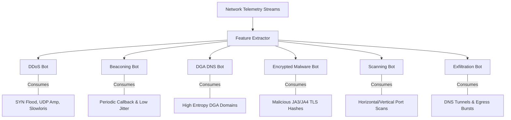

# 📊 Data Subsystem & Synthetic Threat Catalog

Welcome to the **Data Subsystem** of the AI-Powered Cyber Threat Detection System. This directory houses the datasets, synthetic traffic generators, PCAP binary samples, and PostgreSQL / Supabase schemas that power model training, real-time stream ingestion, and security analytics.

---

## 🏗️ Directory Overview

```directory
data/
├── supabase_schema.sql             # Full Supabase PostgreSQL DDL (Tables, Indexes, RLS, Realtime)
├── supabase_seed.sql               # Ready-to-paste SQL seed data for Supabase SQL Editor
├── generate_datasets.py            # Python generator creating all synthetic datasets & PCAPs
├── seed_supabase.py                # Automated REST / SQL seeder for Supabase
│
├── pcaps/                          # Raw packet captures (Wireshark / tcpdump compatible)
│   ├── sample_threats.pcap         # Multi-vector binary PCAP (SYN flood, DNS, HTTP)
│   └── .gitkeep
│
├── flows/                          # Labeled network flow benchmark datasets
│   ├── sample_mixed_flows.json     # 3,300 mixed evaluation flows (80% benign, 20% threats)
│   ├── sample_mixed_flows.csv      # CSV formatted for direct Pandas / Supabase import
│   ├── multi_stage_scenario.json   # 6-stage APT attack timeline (Recon -> C2 -> Exfil -> DDoS)
│   └── .gitkeep
│
└── synthetic/                      # Specialized vector datasets
    ├── benign/                     # Baseline normal network activity
    │   ├── benign_flows.json       # Normal enterprise traffic (HTTPS, HTTP, SSH, DNS, NTP, SMTP)
    │   ├── benign_flows.csv        # Tabular baseline flow records
    │   ├── benign_dns.csv          # Top-1000 benign domain query distribution
    │   └── benign_tls.csv          # Standard browser & OS JA3/JA4 TLS fingerprints
    │
    └── attacks/                    # Malicious traffic organized by specialist bot vector
        ├── syn_flood/              # TCP SYN flood flows (high-rate spoofed sources)
        │   ├── syn_flood_flows.json
        │   └── syn_flood_flows.csv
        ├── udp_amplification/      # DNS (port 53) & NTP (port 123) reflection amplification (40x-75x)
        │   ├── udp_amp_flows.json
        │   └── udp_amp_flows.csv
        ├── slowloris/              # Low-and-slow HTTP resource exhaustion flows
        │   ├── slowloris_flows.json
        │   └── slowloris_flows.csv
        ├── dns_tunneling/          # C2 / Exfiltration encoded subdomains (Base64/Hex in TXT/A)
        │   ├── dns_tunneling_queries.json
        │   └── dns_tunneling_queries.csv
        ├── dga_samples/            # Algorithmic domain queries (Cryptolocker, Necurs, Banjori, Mirai)
        │   ├── dga_queries.json
        │   └── dga_domains.csv
        ├── c2_beaconing/           # Periodic heartbeat callback flows with fixed interval & low jitter
        │   ├── c2_beaconing_flows.json
        │   └── c2_beaconing_flows.csv
        ├── port_scan/              # Vertical port sweeps (1-1024) & horizontal subnet sweeps (/24)
        │   ├── port_scan_flows.json
        │   └── port_scan_flows.csv
        ├── encrypted_malware/      # Malicious TLS sessions with known JA3 hashes (Cobalt Strike, TrickBot)
        │   ├── encrypted_malware_flows.json
        │   └── encrypted_malware_flows.csv
        └── data_exfiltration/      # High-volume egress bursts & anomalous outbound-to-inbound ratios
            ├── exfiltration_flows.json
            └── exfiltration_flows.csv
```

---

## ⚡ Quick Start: Setting Up with Supabase

We use **Supabase** as the primary relational database and real-time event broadcaster for alerts, flows, and bot telemetry.

### Method 1: Supabase Web Dashboard (1-Click Setup)
1. Open your project on [Supabase Dashboard](https://supabase.com/dashboard).
2. Go to **SQL Editor** -> **New query**.
3. Copy and run [`supabase_schema.sql`](file:///mnt/datasheets/SIH_2026%20%28Copy%29/data/supabase_schema.sql) to create all 6 tables, indexes, RLS policies, and Realtime publications.
4. Copy and run [`supabase_seed.sql`](file:///mnt/datasheets/SIH_2026%20%28Copy%29/data/supabase_seed.sql) to populate initial threat alerts, bot health statuses, and blockchain verification proofs.
5. *(Optional)* Go to **Table Editor** -> `network_flows` -> **Import data via CSV** and select [`flows/sample_mixed_flows.csv`](file:///mnt/datasheets/SIH_2026%20%28Copy%29/data/flows/sample_mixed_flows.csv).

### Method 2: Command-Line Seeder
Set your environment variables in `.env`:
```bash
SUPABASE_URL="https://xyzcompany.supabase.co"
SUPABASE_SERVICE_KEY="your-service-role-key"
```
Run the automated seeder:
```bash
python3 data/seed_supabase.py
```

---

## 🗄️ Database Tables & Schema Reference

| Table Name | Primary Key | Description | Realtime Enabled |
| :--- | :--- | :--- | :---: |
| **`network_flows`** | `id` (UUID) | Bidirectional flow telemetry, duration, packet rates, TCP flags, and threat labels | ✅ Yes |
| **`threat_alerts`** | `id` (UUID) | Fused threat alerts with confidence scores, contributing bot breakdown, and on-chain TX hashes | ✅ Yes |
| **`bot_metrics`** | `id` (UUID) | Operational health, latency (ms), CPU/memory, throughput, and accuracy of the 6 AI bots | ✅ Yes |
| **`blockchain_logs`**| `id` (UUID) | Cryptographic audit trail linking alert hashes to EVM smart contract block numbers | ❌ No |
| **`dga_domains`** | `id` (UUID) | Labeled algorithmic domain samples with Shannon entropy and vowel ratio metrics | ❌ No |
| **`dns_queries`** | `id` (UUID) | DNS telemetry logs for tunneling and covert exfiltration channel detection | ❌ No |

---

## 🧬 Feature Definitions & Schema Fields

Each flow record in `network_flows` adheres to the following specification:

| Field | Type | Description | Example / Range |
| :--- | :--- | :--- | :--- |
| `flow_id` | String | Unique flow identifier | `flow_benign_000142` |
| `src_ip` | String | Source IP address (IPv4 / IPv6) | `192.168.1.45` |
| `dst_ip` | String | Destination IP address | `185.220.101.44` |
| `src_port` | Integer | Source port number | `49152` |
| `dst_port` | Integer | Destination port number (service) | `443`, `80`, `53`, `8443` |
| `protocol` | String | Transport / Application protocol | `TCP`, `UDP`, `TLS`, `DNS` |
| `duration` | Float | Flow lifespan in seconds | `0.0001s` – `300.0s` |
| `bytes_in` | BigInt | Inbound bytes received | `0` – `50,000,000` |
| `bytes_out` | BigInt | Outbound bytes transmitted | `40` – `50,000,000` |
| `pkts_in` | Integer | Inbound packet count | `0` – `100,000` |
| `pkts_out` | Integer | Outbound packet count | `1` – `100,000` |
| `tcp_flags` | String | Observed TCP flag combination | `SYN`, `SYN-ACK`, `PSH-ACK`, `FIN` |
| `flow_rate_bps` | Float | Flow bit rate (bits per second) | Calculated |
| `packet_rate_pps`| Float | Packet rate (packets per second) | Calculated |
| `entropy` | Float | Shannon character / byte entropy | `0.0` (low) to `5.0` (high randomness) |
| `ja3_hash` | String | MD5 hash of client TLS ClientHello | `a0e9f5d64349fb13191bc781f81f42e1` |
| `is_attack` | Boolean| Binary ground truth classification | `true` / `false` |
| `attack_type` | String | Fine-grained attack classification | `BENIGN`, `DDOS_SYN_FLOOD`, `C2_BEACONING`, `DGA_DNS`, `ENCRYPTED_MALWARE_TLS`, `PORT_SCAN_VERTICAL`, `PORT_SCAN_HORIZONTAL`, `DATA_EXFILTRATION`, `DOS_SLOWLORIS`, `DDOS_UDP_AMPLIFICATION` |
| `timestamp` | Timestamp| ISO-8601 UTC event arrival time | `2026-08-25T15:30:00Z` |

---

## 🎯 Threat Vectors & Bot Mapping



---

## 🔄 Regenerating Datasets

To regenerate all synthetic datasets with fresh timestamps or updated sample counts:

```bash
# Execute from project root
python3 data/generate_datasets.py
```

Output:
- 3,000 Benign baseline flow records (`data/synthetic/benign/`)
- 4,000+ Specialist attack flow records across all 6 threat vectors (`data/synthetic/attacks/`)
- 3,300 Combined evaluation flows (`data/flows/sample_mixed_flows.json` & `.csv`)
- 6-Stage APT attack scenario (`data/flows/multi_stage_scenario.json`)
- Binary PCAP capture (`data/pcaps/sample_threats.pcap`)
- Updated Supabase seed script (`data/supabase_seed.sql`)
